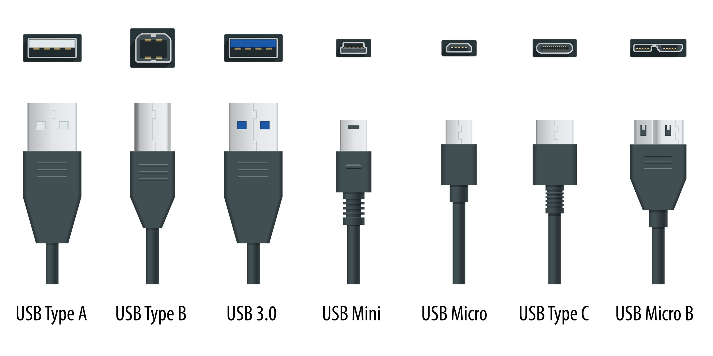

# Le standard USB

## Sommaire

* Introduction
* Principe de fonctionnement
* Évolution
* Bibliographie/Sitographie

## Introduction

Le standard USB pour Universal Serial Bus est en réalité une norme. Une norme de bus informatique qui est utilisé pour connecter des périphériques informatiques. Que se soit pour connecter un disque dur à un ordinateur ou à une télé, mais encore un téléphone, à un ordinateur pour pouvoir récupérer des donnés stokers sur le téléphone.
Le type de connexion USB est dit à chaud, c'est-à-dire que le périphérique peut être branché même après le démarrage de l’outil informatique. Les prises USB ont la possibilité de fournir en énergie des petits appareils informatique comme les souris, les casques audio, les micros ou les claviers, peuvent import du moment que les périphériques en question sont peut gourmant en énergie.
De nos jours l’USB est même utilisé pour charger rapidement des appareils tel que nos téléphones ou certains nouveaux ordinateurs avec la technologie USB type-C.

## Principe de fonctionnement

La bus USB et une connexion à haute vitesse, elle connecte comme dit précédemment deux appareils informatiques. La bus USB est souvent utilisé dans le domaine public, comme la connexion est à chaud et que l’appareil peut être branché et débranché alors que l’appareil hôte est en marche, l’hôte détecte la présence d'un nouveau périphérique aide au changement de tension sur les fils D+ et D-.Cela permet de pouvoir être plus rapide dans les interventions sur un stockage ou de pouvoir vérifier plus de stockage sur différentes clefs USB, par exemple sans avoir à redémarrer l’ordinateur à chaque changement de clef.
Il y a quatre types de transférer définis par l’USB :

* transfert de commande, on utilise ce type de transfert pour configurer les périphériques et pour l'énumération. Il est utile pour les donnés de petites tailles.

* transfert d’interruption, on utilise ce type de transferts si l’on veut, avec une latence faible pour fournir de petites informations. Ici le sens d’interruption n’est pas informatique, dans le cas de ce transfert le périphérique n’envoie pas de donné en continu, il attend que l’hôte l’interroge. Par exemple les claviers et souris utilisent ce type de transfert.

* transfert isochrone, on utilise ce type de transfert avec des donnés très volumineuses en temps réel. Cependant le transfert de ces donnés n’est pas garanti. On utilise ce type de transfert pour les flux vidéo et audio.

* transfert en masse, on utilise ce type de transfert pour envoyer des donnés vraiment très  volumineuses. Mais avec ce transfert on a une garantie d'acheminement de donnés, mais sans garantie de bande passante. On utilise ce type de transfert avec les organes de stockage.

Il existe plusieurs types de bus USB  comme sur les photos ci-dessous :

Les type-A sont destinés aux les hôtes. Sur l’hôte les bus USB sont des bus femelles. Ce qui implique que les bus des câbles sont des mâles. Cependant il existe des bus USB femelles sur des câbles, ce sont des rallonges ou des Hub. Les Hub sont comme des multiprises mais pour USB, certains faits uniquement pour le transfert isochrone et d’autre faits également pour utiliser le transfert d’interruption.

Les USB de type-B quant à eux sont réservés au périphérique.
Comme dit dans l’introduction, les câbles équipé de bus USB 1.0 fournissent de l’énergie, pour se faire, le câble est composé de quatre fils, pour commencer la masse GND (ground) et alimentation VBUS pour les transférer d’énergie. Quant aux données elles utilisent deux autres fils, les fils D+ et D-. Ces deux fils sont torsadés pour limiter les bruits parasites. Le pilote gérant les périphériques USB compare les donner reçu des fils D+ et D- pour éliminer les éventuels perturbations émissent sur un des deux fils.
Les câbles avec des bus USB 2.0 comporte cinq fils, ce qui est 4 de moins que les câbles USB 3.0.

## Evolution

### la norme USB

l’USB fait son apparition au milieu des années 1990. L’USB a été crée pour remplacer les ports externes des ordinateurs qui peuvent être lents voir même incompatibles. La norme USB est passé par plusieurs versions au fur et à mesure des avancées technologiques.
Jusqu’à aujourd’hui il y a eu 4 versions USB qui sont :
La norme USB 0.1 est apparu en 1996 même si en 1998 la version USB 1.1 est arrivé pour apporter des corrections à l’USB1.0.  Cette norme apporte deux modes de communication :

* le _mode lent_  («_Low Speed_ ») qui a une vitesse de 1,5 Mbit/s. Il lie les claviers, les souris, en outre tous les périphériques qui communiquent peuvent de données et qui demandent peut d’énergie.

* le _mode rapide_  (« _Full Speed_  ») lui à une vitesse de 1,5 Mo/s soit de 12 Mbit/s. Ce mode permet quant à lui de lier des périphériques comme les scanners, les imprimantes, les disques durs, les lecteurs de CD, et autres. Tous les périphériques ayant besoin de plus de rapidité et qui ont une alimentation électrique indépendante. Ces périphériques seront du mode rapide. Cependant, beaucoup de stockage de masse ne peuvent utiliser ce mode car il est trop peut rapide pour eux.

En 2000 l’arrivée de la norme USB 0.2 apporte lui un troisième mode de communication

* Le «high Speed » ; ce mode nouveau est plus rapide que les deux précédents, il a une vitesse de 60 Mo/s soit 480 Mbit/s. Il permet un meilleur lien entre les disques durs et les graveurs.

Puis en 2008 la norme USB 0.3 fait son arrivé et apportent un quatrième mode :

* le (« Super Speed »). Ce mode a une vitesse de 4,8 Gbit/s (soit 600 Mo /s.
La bus USB d’un périphérique ne définit pas forcément la vitesse de celui-ci. Si une clef USB est en USB 2.0, cela ne veut pas forcément dire qu’elle a une vitesse high Speed. Cela dépend aussi de la demande du périphérique.

Pour finir il existe la norme USB4 et non 4.0. Elle a été annoncée en 2017 et est arrivée en 2019. Elle apporte l'intégration des fonctionnalités de Thunderbolt3 qui permet notamment les connexions en cascades. L’USB4 apporte une vitesse pouvant aller jusqu’à 40 Gbit/s. Une telle avancer marque un changement radical. Les seuls câbles en USB4 sont des câbles d'équipés de bus USB type-C. Aujourd’hui une version 2 à l’USB4 est annoncée pour septembre 2022.

### Les caractéristiques électriques de l’USB

On pourrait penser qu’il est possible de connecter par exemple un téléphone à un ordinateur. Aujourd’hui tout le monde vous diraient que oui, ce serait possible mais pourquoi?
Au début les bus USB 1.0 n’étaient pas faites pour relier deux appareils hôtes ce qui n’est toujours pas le cas. En effet si les deux appareils sont des appareils hôtes lequel a la main sur l’autre . Alors jusqu’à l’arrivée des bus 2.0 tous les connexions USB était forcément des connexions entre périphérique et hôte. Une question légitime serait « comment est-ce devenu possible ? », le fonctionnement se fait en réalité avec un câble qui arrive à détecter quel est le  périphérique et quel est l’hôte. En réalité il s’agit de deux bus différents. Par exemple si nous branchons un téléphone à un ordinateur, la liaison se fera d’un côté avec une buse USB type-A et  de l’autre côté un bus USB type-C ou autres tout dépend du modèle de téléphone ou de périphérique.

## bibliographie

[_standard USB_](https://www.blackbox.fr/fr-fr/page/28833/Information/Technique/black-box-explique/USB(Bus-Serie-Universel)/Standards-USB)

[_Techno-Science.net_](https://www.techno-science.net/glossaire-definition/Universal-Serial-Bus.html#ref)

[USB](https://fr.wikipedia.org/wiki/USB),faite le 28 octobre 2022 à 03:00h.
